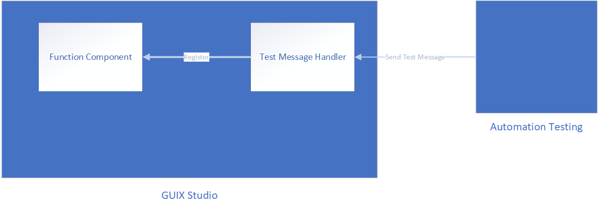

# GUIX and GUIX Studio Regression Test Guide
## Introduction
This guide provides instructions on how to run and add GUIX and GUIX Studio regression tests, along with effective debugging techniques for failed test cases. Regression testing is essential for ensuring that new code changes do not introduce new bugs or regressions. By following the steps outlined in this guide, you can contribute to maintaining a stable and reliable codebase.

## Table of Contents
1. [GUIX Regression Test](#guix-regression-test)
    1. [Directory Structure](#directory-structure)
    2. [Types of Test Cases](#types-of-test-cases)
    3. [Prerequisites](#prerequisites)
    4. [Run Regression Test](#run-regression-test)
    5. [Run One Test Case](#run-one-test-case)
    6. [Debug Failed Test](#debug-failed-test)
    7. [Add New Test](#add-new-test)
    8. [Add New Build Type](#add-new-build-type)
2. [GUIX Studio Regression Test](#guix-studio-regression-test)
    1. [Directory Structure](#directory-structure-1)
    2. [GUIX Studio Test Demo](#guix-studio-test-demo)
        1. [Run GUIX Studio Test Demo](#run-guix-studio-test-demo)
        2. [Debug Failed Test](#debug-failed-test)
        3. [Add New Test Case](#add-new-test-case)
    3. [GUIX Studio Test View](#guix-studio-test-view)
        1. [Architecture](#architecture)
        2. [Run GUIX Studio Test View](#run-guix-studio-test-view)
        3. [Debug Failed Test](#debug-failed-test-1)
        4. [Add New Test Case](#add-new-test-case-1)

## GUIX Regression Test

### Directory Structure

The GUIX regression test is built on top of the CMake build system and organize its code in `test\guix_test `folder. The foundational elements are structured as follows:
- **cmake\CMakeLists.txt:** The CMake file that defines the build types and the test suites.
- **cmake\regression\CMakeLists.txt:** The CMake file that defines the test cases for each test suite.
- **coverage.sh:** The script that generates the coverage report.
- **run.sh:** The script that builds and runs the tests.
- **display_driver:** This directory hosts the display drivers used by the tests.
- **golden_files:** This directory contains golden files used for verification during the tests, aiding in the comparison of expected and actual outcomes.
- **regression_test\tests:** This directory contains the all GUIX regression tests.
- **regression_test\utility:** This directory hosts utility files used by the regression test.
- **regression_test\gx_show_canvas.exe:** A tool that displays GUIX canvas data that stored in a binary file.

### Types of Test Cases

1. **Test case with output:**
- In the generation mode, after each test point, a specified area of the GUIX canvas is saved to a binary file named `<test_name>.bin`.
- A checksum value, calculated based on the canvas data, is saved to a file named `<test_name>.checksum`.
- The binary file is used for checking the correctness of the test case visually.
- The checksum file enables faster verification during tests by comparing expected and actual checksum values. 

2. **Test case without output:**
- In this type of test code, the test code typically checks the API return status or the values of a variable to verify the correctness of the test case.

### Prerequisites
1. Linux environment.
2. Clone the GUIX repository.
3. Install required packages using script `install.sh` located in the `scripts` directory.

### Run Regression Test
1. Navigate to the `test\guix_test\cmake` directory.

2. To build and run all the tests, use the following commands.
```bash
./run.sh build all
./run.sh run all
```

3. To build and run a specific test suite, use the following commands.
```bash
./run.sh build <build_type>
./run.sh run <build_type>
```

The available build types are as follows:

|Build Types|Description|Build Configuration Settings|
|--------------|-----------|----------------------------|
|default_build_coverage|Build with default configuration settings and generate coverage report|N/A|
|disable_error_checking_build|Build with error checking disabled|*GX_DISABLE_ERROR_CHECKING*|
|no_utf8_build_coverage|Build with UTF-8 support disabled and generate coverage report|GX_DISABLE_UTF8_SUPPORT and GX_DISABLE_ERROR_CHECKING|
|no_utf8_no_checking_build|Build with UTF-8 support disabled and error checking disabled|GX_DISABLE_UTF8_SUPPORT and GX_DISABLE_ERROR_CHECKING|
|ex_unicode_build|Build with extended Unicode support|GX_EXTENDED_UNICODE_SUPPORT|
|ex_unicode_no_checking_build|Build with extended Unicode support and error checking disabled|GX_EXTENDED_UNICODE_SUPPORT and GX_DISABLE_ERROR_CHECKING|
|mouse_support_build|Build with mouse support|GX_MOUSE_SUPPORT|
|font_kerning_support_build|Build with font kerning support|GX_FONT_KERNING_SUPPORT|
|dynamic_bidi_text_build|Build with dynamic bi-directional text support|GX_DYNAMIC_BIDI_TEXT_SUPPORT and GX_DYNAMIC_ARABIC_SHAPING_SUPPORT|
|dynamic_bidi_text_no_checking_build|Build with dynamic bi-directional text support and error checking disabled|GX_DYNAMIC_BIDI_TEXT_SUPPORT, GX_DYNAMIC_ARABIC_SHAPING_SUPPORT and GX_DISABLE_ERROR_CHECKING|
|_5_4_0_compatible_no_checking_build|Build with GUIX library version 5.4.0 compatibility and error checking disabled|GX_DISABLE_ERROR_CHECKING and GUIX_5_4_0_COMPATIBILITY|
|synergy_font_support_build|Build with synergy font support|GX_SYNERGY_FONT_FORMAT_SUPPORT|
|thai_glyph_shaping_support_build|Build with Thai glyph shaping support|GX_THAI_GLYPH_SHAPING_SUPPORT|
|palette_mode_aa_text_colors_16_build|Build with palette mode with 16 colors for text drawing support|GX_PALETTE_MODE_AA_TEXT_COLORS=16|
|disable_deprecated_string_api_build|Build with deprecated string API disabled|GX_DISABLE_DEPRECATED_STRING_API|
|partial_canvas_support_build|Build with partial canvas support|GX_ENABLE_CANVAS_PARTIAL_FRAME_BUFFER|
|partial_canvas_support_vertical_refresh_build|Build with partial canvas support and vertical refresh|GX_ENABLE_CANVAS_PARTIAL_FRAME_BUFFER and GX_CANVAS_REFRESH_DIRECTION_VERTICAL|
|partial_canvas_support_horizontal_refresh_build|Build with partial canvas support and horizontal refresh|GX_ENABLE_CANVAS_PARTIAL_FRAME_BUFFER and GX_CANVAS_REFRESH_DIRECTION_HORIZONTAL|
|||

The **test reports** for each build type will be generated in the `test\guix_test\cmake\build\<build_type>` directory.

The **coverage report** for `default_build_covearge` and `no_utf8_build_coverage` will be generated in the `test\guix_test\cmake\coverage_report` directory. For other build types, no coverage report is generated.

### Run One Test Case

Follow these steps to execute an individual test case:

1. Build the test using the instructions provided in the previous section.
2. Navigate to the `test\guix_test\cmake\build\<build_type>\regression` directory, where the test executables are generated.

3. Run the test without output, where the test name is ended with `no_output`.
```bash
./<test_name>
```

4. Run other tests with checksum verification and specify the golden files path with the following command.
```bash
 ./<test_name> -checksum -gpath ../../../../golden_files/
 ```

### Debug Failed Test

- Debugging with cgdb.
1. Navigate to the `test\guix_test\cmake\build\<build_type>\regression` directory, where the test executables are generated. Start cgdb using the following command.
```bash
cgdb <test_name>
```

2. Set configuration parameter `-r` to run test without comparison.
```bash
set args -r
```

3. Set breakpoints as needed and run the test.

- Debugging by comparing output files.
1. Navigate to the `test\guix_test\cmake\build\<build_type>\regression\output_files` directory, where the failed output binary file is generated. The generated binary file is named `<test_name>_failures.bin`.

2. Use **gx_show_canvas.exe** located in `test\guix_test\regression_test` to display the content in the failed output binary file. Compare it with the corresponding golden file located in the `test\guix_test\golden_files` directory. For the usage of **gx_show_canvas.exe**, please refer to **gx_show_canvas.md**.


### Add New Test

Follow these steps to add a new test:
1. Create Win32 Demo Project.
- Generate a Win32 demo project under the `test\example_internal` directory.
- Ensure the main source file is named as `demo_guix_<example_name>.c`.

2. Add Test Source File:
- Place the test source file in the `test\guix_test\regression_test\tests` directory.
- Name the test file start with `validation_guix`.

3. Implement the Test Case:
- In the test source file, include the necessary header files:
```c
#include <stdio.h>
#include "tx_api.h"
#include "gx_api.h"
#include "gx_validation_utility.h"
```

- Set test parameters:
```c
TEST_PARAM test_parameter = {
    "", /* Test name */
    0, 0, 0, 0  /* Define the coordinates of the capture area.*/
};
```

Definition of the TEST_PARAM structure:
```c
typedef struct TEST_PARAM_S 
{

    char *test_name;          /* Must be set */


    /* The following parameters defines the screen area to capture.
       If 0, capture the whole screen. */
       
    int x_start;   
    int y_start;
    int x_end;
    int y_end;
} TEST_PARAM;
```

- Define the main function:
```c
int main(int argc, char ** argv)
{
    /* Start ThreadX system */
    tx_kernel_enter(); 
    return(0);
}
```

- Create the test thread:
```c
static VOID control_thread_entry(ULONG);

VOID tx_application_define(void *first_unused_memory)
{
    gx_validation_application_define(first_unused_memory);
    
    /* Termiante the test if it runs for more than 100 ticks */
    /* This function is not implemented yet. */
    gx_validation_watchdog_create(100);

    /* Create a dedicated thread to perform various operations
       on the line drawing example. These operations simulate 
       user input. */
    gx_validation_control_thread_create(control_thread_entry);
}
```

- Include the test example source code:
```c
#ifdef WIN32
#undef WIN32
#endif

#include "gx_validation_wrapper.h"
#include "demo_guix_<example_name>.c"
```

The test example source code also contains a main function, The header file `gx_validation_wrapper.h` is used to replace the main function in the test example source code.

- Thread entry example for test case without output:
```c
static VOID control_thread_entry(ULONG input)
{
int               failed_tests = 0;
UINT              status;
GX_PROMPT        *prompt = &button_screen.button_screen_title_1;
GX_CONST GX_CHAR *text;

    gx_widget_hide(&button_screen); 

    status = gx_prompt_text_get(prompt, &text);
    EXPECT_EQ(GX_INVALID_CANVAS, status);

    if(failed_tests == 0) 
    {
        gx_validation_print_test_result(TEST_SUCCESS);
        exit(0);
    }
    else 
    {
        gx_validation_print_test_result(TEST_FAIL);
        exit(1);
    }
}
```

- Thread entry example for test case with output:
```c
static VOID control_thread_entry(ULONG input)
{
int frame_id = 1;
GX_EVENT my_event;

    memset(&my_event, 0, sizeof(GX_EVENT));
    my_event.gx_event_display_handle = 1;

    gx_validation_set_frame_id(frame_id++);
    gx_validation_set_frame_comment("Initialize the screen.");
    gx_validation_screen_refresh();

    /* Simulate a pen down event. */
    my_event.gx_event_type = GX_EVENT_PEN_DOWN;
    my_event.gx_event_payload.gx_event_pointdata.gx_point_x = 207;
    my_event.gx_event_payload.gx_event_pointdata.gx_point_y = 376;
    gx_system_event_send(&my_event);

    /* Simulate a pen up event. */
    my_event.gx_event_type = GX_EVENT_PEN_UP;
    gx_system_event_send(&my_event);

    /* Force a screen refresh to capture the canvas data or compare the checksum. */
    gx_validation_set_frame_id(frame_id++);
    gx_validation_set_frame_comment("Scroll the vertical list.");
    gx_validation_screen_refresh();

    /* Signal the end of the test case.  Verify the output. */
    gx_validation_end();

    exit(0);
}
```

4. Add Test Case to GUIX Regression Test System:
- Open the `test\guix_test\cmake\regression\CMakeLists.txt` file.
- Add test demo project to the appropriate demo list based on the demo build configuration settings. The available types of demo lists are as follows:

| Types of Demo Lists |Description                     | Build Configuration Settings |
| ------------------- | ------------------------------ | ---------------------------- |
| NO_UTF8_DEMOS       |Demos that do not support UTF-8 | GX_DISABLE_UT8_SUPPORT       |
| EXTENDED_UNICODE_DEMOS |Demos that support extended Unicode | GX_EXTENDED_UNICODE_SUPPORT |
| OTHER_DEMOS | Demos with default configuration settings | N/A |
| MOUSE_SUPPORT_DEMOS | Demos support mouse input | GX_MOUSE_SUPPORT |
| FONT_KERNING_SUPPORT_DEMOS | Demos support font kerning | GX_FONT_KERNING_SUPPORT |
| DYNAMIC_BIDI_TEXT_DEMOS | Demos support dynamic bi-directional text | GX_DYNAMIC_BIDI_TEXT_SUPPORT and GX_DYNAMIC_ARABIC_SHAPING_SUPPORT |
| _5_4_0_COMPATIBLE_DEMOS | Demos that compatible with GUIX library version 5.4.0 | GUIX_5_4_0_COMPATIBILITY |
| SYNERGY_FONT_SUPPORT_DEMOS | Demos that support synergy font | GX_SYNERGY_FONT_FORMAT_SUPPORT |
| THAI_GLYPH_SHAPING_SUPPORT_DEMOS | Demos that support Thai glyph shaping | GX_THAI_GLYPH_SHAPING_SUPPORT |
| PALETTE_MODE_AA_TEXT_COLORS_16_DEMOS | Demos that support palette mode with 16 colors for text drawing | GX_PALETTE_MODE_AA_TEXT_COLORS=16 |
| PARTIAL_CANVAS_SUPPORT_DEMOS | Demos that support partial canvas | GX_ENABLE_CANVAS_PARTIAL_FRAME_BUFFER |

- Define demo project file list:
```c
set(<example_name>_FILE_LIST
    demo_guix_<example_name>.c
    ...)
```

- Define test case for demo project:
```c
set(<example_name>_REG_TESTS
    <test_name>
    ...)
```

5. Generate Golden Files:
- Build GUIX regression test with the appropriate build type based on the demo build configuration settings. 

- Generate golden files for the test case. If the test has no output, this step can be skipped.
    - Navigate to the `test\guix_test\cmake\build\<build_type>\regression` directory, where the test executables are generated.

    - Generate output files for the test case with the following command.
    ```bash
    ./<test_name> -r -generate
    ```
    After the command is executed, the output binary file `<test_name>.bin` and checksum file `<test_name>.checksum` will be generated in the `test\guix_test\cmake\build\<build_type>\regression\output_files` directory.

    - Verify the correctness of the test by checking the content of the output binary file `<test_name>.bin` with the **gx_show_canvas.exe** tool located in `test\guix_test\regression_test`.

    - Compress the output binary file `<test_name>.bin` into a 7z file with the following command.
    ```bash
    7z a <test_name>.7z <test_name>.bin
    ```

    - Copy the 7z file `<test_name>.7z` and `<test_name>.checksum` to the `test\guix_test\golden_files` directory.

- Run the GUIX regression test to see if the test case passes.

- Now the test case is ready to be submitted to the GUIX repository.

### Add New Build Type

If the available build types lack the configuration settings required for your test, you can add a new build type by following these steps:

1. Open the `test\guix_test\cmake\CMakeLists.txt` file.
2. Add a new build type using the following example:
```cmake
set(disable_error_checking_build -DGX_DISABLE_ERROR_CHECKING)
```
3. Include the new build type in the `BUILD_CONFIGURATIONS` list.
```cmake
set(BUILD_CONFIGURATIONS
...
    <new_build_type>
)
```

4. Add the new demo type.
- Open the `test\guix_test\cmake\regression\CMakeLists.txt` file.
- Define a new demo type list and add the new example project to it:
```cmake
set (<demo_type_name> <example_name>)
```

- Set the directory path for the new demos by updating the existing logic:
```cmake
set(EXAMPLE_INTERNAL_DIR ${ROOT_DIR}/example_internal)
foreach(
  demo
...
  ${<demo_type_name>};
...
  set(${demo}_SOURCE_DIRECTORY ${EXAMPLE_INTERNAL_DIR}/${demo})
endforeach()
```

- Update the existing logic to set the `demos` variable according to the build type. This variable will later be used to add test cases for the build type:
```cmake
...
elseif("-D<new_build_configuration>" IN_LIST ${CMAKE_BUILD_TYPE})
  set(demos ${<demo_type_name>})
...
```

- Update existing logic to set regression test program's SOURCE as `validation_*.c` and related source files, excluding `demo_*` for the test cases of the new demo type:
```cmake
# Set regression test program's SOURCE as validation_*.c and related source
# files excluding demo_*
foreach(
  demo
...
  ${<demo_type_name>};
...
endforeach()
```

## GUIX Studio Regression Test

### Prerequisites
1. Windows environment.
2. Clone the GUIX repository.
3. Install Python 3.0 or later.
4. Install Visual Studio 2019.

### GUIX Studio Test Demo

The demo tests are located in the `test\guix_studio_test\test_demo` directory.

Target Directories: `examples`, `tutorials` and `test\example_internal`.

#### Run GUIX Studio Test Demo
1. Open developer command prompt for Visual Studio 2019.
2. Navigate to the `test\guix_studio_test\test_demo` directory.
3. To verify the output files for the `gxp` projects under the target directories, run the following command.
```python
test_main.py -b -t
```
- `-b` option is used to build the latest GUIX Studio executable.
- `-t` option is used to verify the output files for the `gxp` projects under the target directories.

4. To test the compilation of the Visual Studio project under the target directories, run the following command.
```python
test_main.py --compile_project
```

5. To regenerate output files for the `gxp` projects under the target directories, run the following command.
```python
test_main.py -b -g
```

6. To upgrade project version to the latest for the `gxp` projects under the target directories, run the following command.
```python
test_main.py --update_gxp_project
```

7. To set GUIX library version for the `gxp` projects under the target directories, run the following command.
```python
test_main.py -v <VERSION>
```
replace `<VERSION>` with the actual GUIX library version. such as `6.2.0`.

#### Debug Failed Test

After test execution, a test log file named `output_files_test_log.txt` will be generated in the current directory. If a test case failed, the log file provides detailed information about the failure.

#### Add New Test Case

If you have added a new `gxp` project under the target directories, this project will be automatically added to the test system. However, if your project involves the generation of binary files or other output files requiring verification, it is necessary to develop project-specific resource output logic. For guidance, you can consult the implementation of functions such as `test_utils::test_one_project()` and `test_utils.generate()`.


### GUIX Studio Test View

The test view tests are located in the `test\guix_studio_test\test_view` directory.

#### Architecture

*Figure 1: GUIX Studio Test View Architecture*

GUIX Studio provides a test message handler for each function component, enabling interaction with the GUIX Studio Test View, a Python based test application that communicates with GUIX Studio by transmitting messages through these handlers. The `test_utils.py` module facilitates the sending of messages to individual function components within GUIX Studio. Utilizing these functions allows you to simulate user actions for the purpose of testing GUIX Studio.  For example, you can use `test_utils::open_project()` to open a project in GUIX Studio.

GUIX Studio Test View verifies the correctness of the test through two aspects:
1. Comparing the checksum of the canvas data with the corresponding value stored in the golden files. The `test_utils.py` module includes the `test_utils::compare_result()` function, which facilitates this comparison process. In test mode, it checks the checksum of the canvas data against the correct value in the golden files. In generation mode, the function generates checksum values and stores them in the specified golden file.

2. Comparing the output files of the testing `gxp` project with the corresponding files stored in the `golden_files` directory. the `test_utils.py` module includes the `test_utils::cmp_output_files()` function, which facilitates this comparison process.

#### Run GUIX Studio Test View
1. Open developer command prompt for Visual Studio 2019.
2. Navigate to the `test\guix_studio_test\test_view` directory.
3. Run the entire test with the following command.
```python
test_main.py -b
```
4. Run a specific test by specifying its name with the following command.
```python
test_main.py -b <test_name>
```

To explore the available test cases and obtain more information, use the following command to display the help message:
```python
test_main.py -h
```

#### Debug Failed Test
After test execution, a test log file named `studio_view_test_log.txt` will be generated in the current directory. If a test case failed, the log file provides detailed information about the failure. If the test fails due to canvas data mismatch, a `test_failure` folder is generated in the current directory, which contains the screenshot of the failed test case.

#### Add New Test Case
1. Add a new test file.
2. Import the necessary modules.
```python
import os
import sys
import time
import test_utils
import test_constants
```

3. Define test header for the test information.
```python
def get_test_header(): 
    notes =  "*             <Test Name>                             *\n"
    notes += "*                                                     *\n"
    ...
    return notes
```

4. Define test case.
```python
def <test_name>(generate, screenshot):
    test_utils.output_test_header(get_test_header())
    test_utils.setup(generate, screenshot, <golden_file_name>)

    # Test code goes here.

    test_utils.write_end(<test_name>)
```

5. Import the new test case to `test_main.py`.

- Import the new test module:
```python
from <test_file_name> import <test_name>
```

- Add argument for the new test case:
```python
parser.add_argument('--<test_name>', action='store_true', dest='<test_name>' help='Run <test_name> test')
```

- Update existing logic to set the new test case to run when the user doesn't specify tests to run:
```python
if (... and
    args.<test_name> is False):
    ...
    test_utils.<test_name> = True
    ...
```

- Add logic to run test case:
```python
if test_utils.<test_name>:
    <test_name>(args.generate, args.screenshot)
```

- Generate golden files for the new test case:
```python
test_main.py -b --<test_name> -g
```

- Copy the golden files to the `test\guix_studio_test\golden_files` directory.
- Run the new test case to see if it passes.
```python
test_main.py -b --<test_name>
```
- Now the test case is ready to be submitted to the GUIX repository.