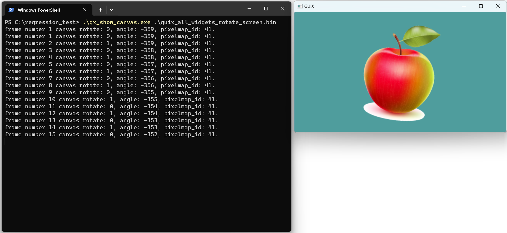

# Description:

`gx_show_canvas.exe` is a tool to display the picture data that stored in a bin file, which generated from regression test.

# Usage: 
1. Open a command prompt window.
2. Change directory to your working directory.
3. Copy gx_show_canvas.exe and output *.bin files to your working directory.
4. Run the following command to show canvas data stored in a binary file.
```bash
gx_show_canvas.exe <binary_file_name>
```


Figure 1. Example of gx_show_canvas.exe


5. Keyboard up/down arrows can be used to move between current frame and previous/next frame.
